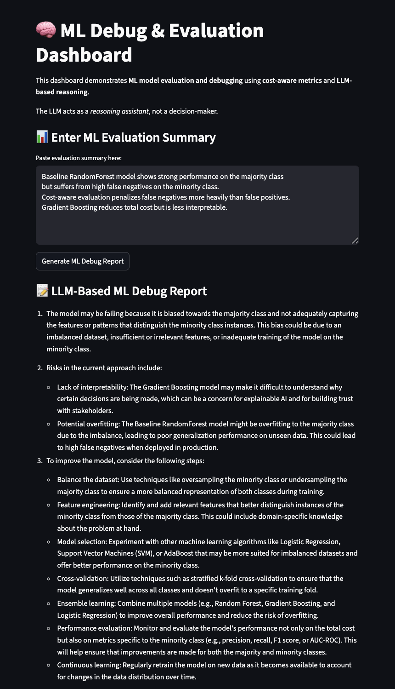
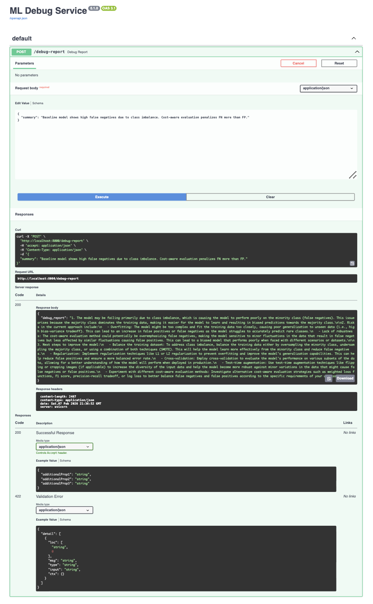

# 🧠 Cost-Aware ML Evaluation & Debugging Platform with LLM Reasoning


A **production-style machine learning platform** that evaluates models using
**cost-aware metrics**, analyzes failure patterns, and leverages a **large
language model (LLM) as a reasoning assistant** to generate actionable debugging
insights.

This project focuses on **how ML models fail**, not just how they perform.

---

## 🚀 Why This Project Is Different

Most ML projects stop at accuracy.

This project goes further by:
- Quantifying **business cost of errors**
- Comparing models based on **risk trade-offs**
- Optimizing **decision thresholds**
- Using LLMs for **reasoning**, not prediction
- Exposing ML evaluation as a **backend service**
- Providing a **live interactive UI**

This reflects **real-world ML engineering**, not notebook-only experimentation.

---

## 🧩 System Architecture
```bash
Dataset
↓
Multiple ML Models
↓
Predictions & Probabilities
↓
Cost-Aware Evaluation
↓
Error & Failure Analysis
↓
Threshold Optimization
↓
Structured Experiment Results
↓
LLM Reasoning Engine
↓
FastAPI Backend
↓
Streamlit Dashboard
```
---

## 📊 Machine Learning Highlights

- Binary classification with class imbalance
- Precision, recall, F1-score analysis
- Explicit false negative vs false positive trade-offs
- Cost-sensitive evaluation
- Threshold optimization based on expected cost
- Multi-model comparison (Logistic Regression, Random Forest, Gradient Boosting)

---

## 🤖 Role of the LLM

The LLM **does not replace the ML model**.

It is used as a **reasoning assistant** to:
- Interpret metrics and error patterns
- Highlight risks in model behavior
- Suggest improvement strategies

All decisions remain **evidence-driven and human-controlled**.

---

## 🧠 API & UI

### Backend (FastAPI)
- `/debug-report` — generate ML debugging insights
- Designed for reuse and system integration
- Fully testable with mocked LLM dependencies

### Frontend (Streamlit)
- Interactive ML evaluation demo
- Displays LLM-generated debug reports
- Built for recruiter-friendly demonstrations

---

## 🐳 Deployment

The platform is fully containerized using **Docker Compose**:

```bash
docker compose up --build
```

### Access

- **Streamlit UI:** http://localhost:8501

- **API Docs (Swagger):** http://localhost:8000/docs

- **LLM runs externally via Ollama**

---

## 🧪 Testing

- Automated API tests using pytest
- External LLM calls mocked for reliability
- Focus on API contracts and stability

## 📸 Screenshots

**Streamlit ML Debug Dashboard**



**FastAPI Swagger Documentation**



---

## 🛠 Tech Stack

**Core Technologies**
- Python 3.10
- Scikit-learn
- NumPy & Pandas

**Backend**
- FastAPI
- Pydantic

**Frontend**
- Streamlit

**Explainable AI**
- Ollama (local LLM runtime)
- Mistral (LLM)

**Deployment**
- Docker
- Docker Compose

---

## 🔮 Future Improvements

- CI pipeline (GitHub Actions)
- Experiment tracking
- Cost-sensitive model tuning
- Model versioning


